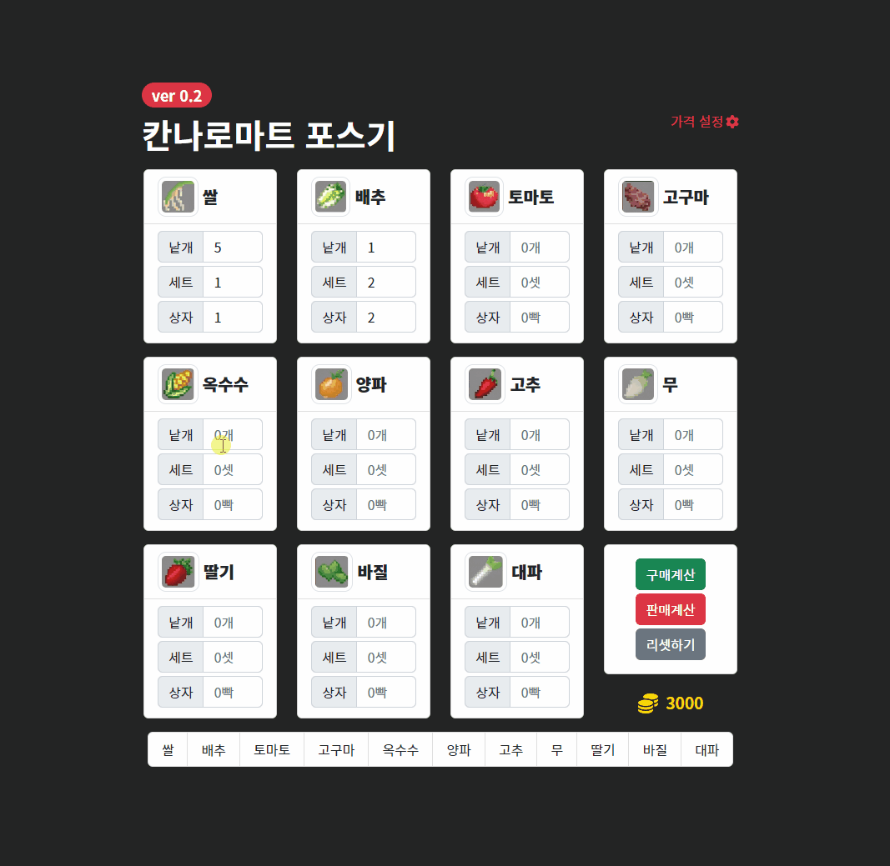
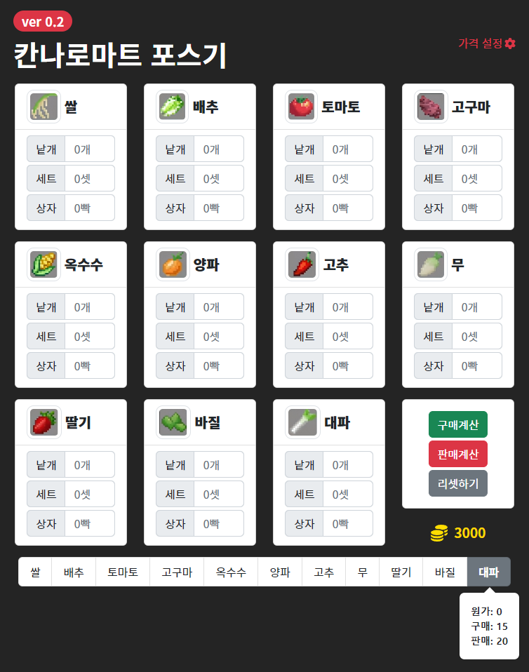
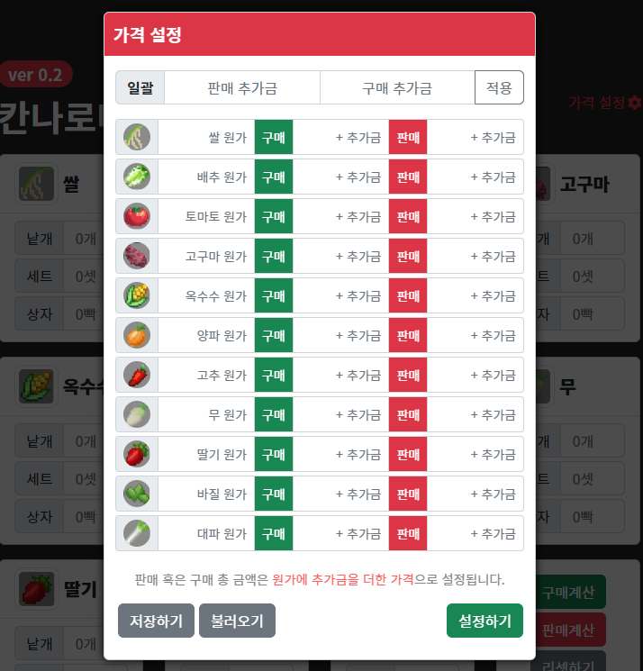

# 칸나로 마트 포스기 v0.2
    

**Kannaro-Mart POS MACHINE** for Twitch Streamer "한동숙" 

- **2023.5.25.** 개인적 사유로 일시적 중단

## Preview
<!-- {: width="60%" height="60%"} -->

## v0.1
트위치 방송 마인크래프트 '악어의 놀이터' 서버의  
**칸나로마트**를 운영하는 스트리머 한동숙을 위한 마트 자동 계산 POS기
- 기본 UI 추가

## v0.2
- 판매 가격 프리뷰 툴팁 기능 추가  
  

- 가격 설정 UI 추가  
  
  
## v1.0 예정
- UI 및 기능 코드 전체 재검토 예정
  - 상태 관리 API 사용 예정
  - UI 간소화 및 스타일 변경
- 반응형 스타일 추가 예정
  - LARGE, SMALL 두 개의 미디어 쿼리 추가
  - 그리드 변경
- 저장 기능 추가 예정
  - LocalStorage 활용
  - 저장한 데이터 불러오기 추가 예정
